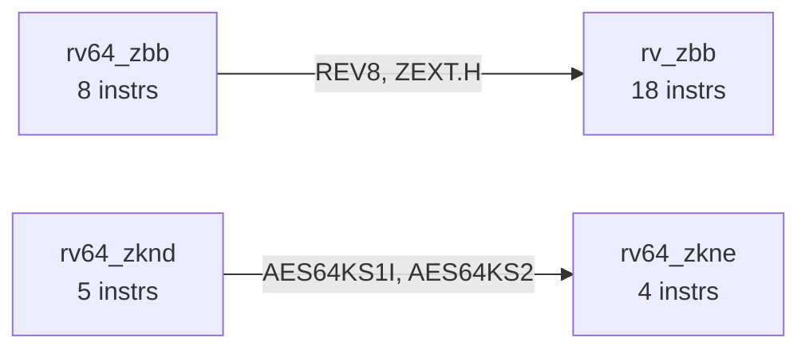

# RISC-V Instruction Set Explorer

A Python tool that parses the RISC-V instruction dictionary, cross-references it against
the official ISA manual, and visualises extension relationships — fulfilling all three
tiers of the RISC-V Mentorship Coding Challenge.

---

## Project Structure

```
riscv-explorer/
├── main.py                    # CLI entry point (all tiers)
├── src/
│   ├── tier1.py               # Instruction parsing & grouping
│   ├── tier2.py               # ISA manual cross-reference
│   └── tier3.py               # Sharing graph (text + DOT + Mermaid)
├── tests/
│   └── test_explorer.py       # 48 unit tests (unittest / pytest)
├── output/                    # Generated graph files land here
│   ├── extension_graph.dot    # GraphViz DOT
│   └── extension_graph.mmd    # Mermaid diagram
├── sample_instr_dict.json     # Offline sample (214 instructions, 25 extensions)
└── README.md
```

---

## Requirements

- Python **3.9+**  (no third-party dependencies needed for the main program)
- `pytest` for running the unit tests (optional)

```bash
pip install pytest          # only needed to run tests
```

---

## How to Run

### Option A — Live fetch from GitHub (recommended)

```bash
python main.py
```

The program tries to:
1. Fetch `instr_dict.json` from `riscv/riscv-opcodes` via the GitHub raw URL.
2. Fetch the ISA-manual `.adoc` sources from `riscv/riscv-isa-manual` via the GitHub API.

If either request is rate-limited or blocked the program falls back gracefully (see below).

### Option B — Provide a local `instr_dict.json`

```bash
# Download the file once
curl -O https://raw.githubusercontent.com/riscv/riscv-opcodes/master/instr_dict.json

# Run against it
python main.py --instr-dict instr_dict.json
```

You can also set the environment variable:

```bash
export RISCV_INSTR_DICT=/path/to/instr_dict.json
python main.py
```

### Option C — Use the bundled sample (offline demo)

```bash
python main.py --instr-dict sample_instr_dict.json
```

### Running individual tiers

```bash
python main.py --tier 1                        # Tier 1 only
python main.py --tier 1 --tier 2               # Tier 1 + Tier 2
python main.py --tier 3 --output-dir /tmp/g    # Tier 3 with custom output dir
```

---

## Running the Tests

```bash
python -m pytest tests/ -v
# or without pytest:
python -m unittest discover tests/
```

All **48 tests** should pass.  Coverage spans:

| Class | Tests | What is covered |
|---|---|---|
| `TestTier1Parsing` | 16 | Grouping, sorting, multi-extension detection, file loading, edge cases |
| `TestTier2Normalisation` | 19 | JSON & manual name normalisation, cross-reference logic, offline fallback |
| `TestTier3Graph` | 13 | Graph construction, adjacency symmetry, DOT/Mermaid export |

---

## Sample Output

### Tier 1

```
===================================================
  RISC-V Extension Summary
===================================================
+-------------+----------------+------------------+
| Extension   | # Instructions | Example Mnemonic |
+=============+================+==================+
| rv_i        |             40 | ADD              |
| rv_f        |             26 | FADD.S           |
| rv_d        |             22 | FADD.D           |
| rv_zbb      |             18 | ANDN             |
| rv64_i      |             12 | ADDIW            |
| rv_a        |             11 | AMOADD.W         |
| rv_v        |             10 | VADD.VI          |
| rv_m        |              8 | DIV              |
...
+-------------+----------------+------------------+

Total extensions : 25
Total entries    : 218

============================================================
  Instructions belonging to multiple extensions
============================================================
  AES64KS1I            -> rv64_zknd, rv64_zkne
  AES64KS2             -> rv64_zknd, rv64_zkne
  REV8                 -> rv_zbb, rv64_zbb
  ZEXT.H               -> rv_zbb, rv64_zbb
```

### Tier 2

```
======================================================================
  Tier 2 — Cross-Reference Report
  Manual source: offline fallback list
======================================================================

✅  MATCHED (17) — present in both instr_dict.json and the ISA manual:
    rv_a  rv_d  rv_f  rv_i  rv_m  rv_v  rv_zba  rv_zbb  rv_zbc  ...

⚠️   JSON-ONLY (0) — in instr_dict.json but NOT mentioned in the manual:
    (none)

📖  MANUAL-ONLY (46) — mentioned in manual but NOT in instr_dict.json:
    B  C  E  H  Zacas  Zawrs  Zbkb  Zfh  Zicntr  ...

  Summary: 17 matched, 0 in JSON only, 46 in manual only
```

### Tier 3 — Text Graph

```
  [ Adjacency List ]

  rv64_zbb
    └─── rv_zbb  [REV8, ZEXT.H]
  rv64_zknd
    └─── rv64_zkne  [AES64KS1I, AES64KS2]
```

### Tier 3 — Mermaid (rendered)

The generated `output/extension_graph.mmd` can be pasted into
[mermaid.live](https://mermaid.live) for a visual rendering:



---

## Design Decisions

### Extension normalisation (Tier 2 key challenge)

The two sources use different naming conventions:

| Source | Example |
|---|---|
| `instr_dict.json` | `rv_zba`, `rv64_zba`, `rv32_zknh` |
| ISA manual AsciiDoc | `Zba`, `RV32I`, `M` |

The normaliser strips the leading `rv[32\|64\|128]?_` prefix and lower-cases,
so `rv_zba`, `rv64_zba` and `Zba` all collapse to the canonical key `zba`.
Special cases: `RV32I`/`RV64GC` → `i` (base integer), `Hypervisor` → `h`.

### Graceful degradation

Every network call is wrapped in a try/except.  If GitHub is unreachable:
- **Tier 1**: falls back to local sample files.
- **Tier 2**: falls back to `OFFLINE_MANUAL_EXTENSIONS`, a curated list of ~50
  extensions known to appear in the ISA manual sources.

### Multi-extension instructions

Some instructions (e.g. `zext.h`) appear in both `rv_zbb` **and** `rv64_zbb`
because the 32-bit and 64-bit variants share the same encoding. This is expected
and is reported explicitly rather than treated as a data error.

### Count semantics

"Total entries" in the Tier 1 table counts appearances (one per extension per
instruction), not unique mnemonics.  The distinction is noted in the output.

### Graph format

Both DOT (GraphViz) and Mermaid are generated because:
- DOT produces high-quality PDFs/PNGs with `dot -Tpng`.
- Mermaid renders natively on GitHub, GitLab, and Notion.

---

## Assumptions

1. The `extension` field in `instr_dict.json` is always a list of strings (or,
   defensively, a bare string — both are handled).
2. Instructions without an `extension` field are silently skipped.
3. The ISA manual is scanned for extension *tokens* using a conservative regex;
   false positives (e.g. isolated `C` in prose) are possible but rare and do
   not affect correctness for ratified extensions.
4. The offline fallback list in `tier2.py` was compiled from the manual's `src/`
   directory as of early 2025 and may not reflect the very latest drafts.

---

## License

Apache 2.0 — same as the upstream RISC-V Opcodes repository.
